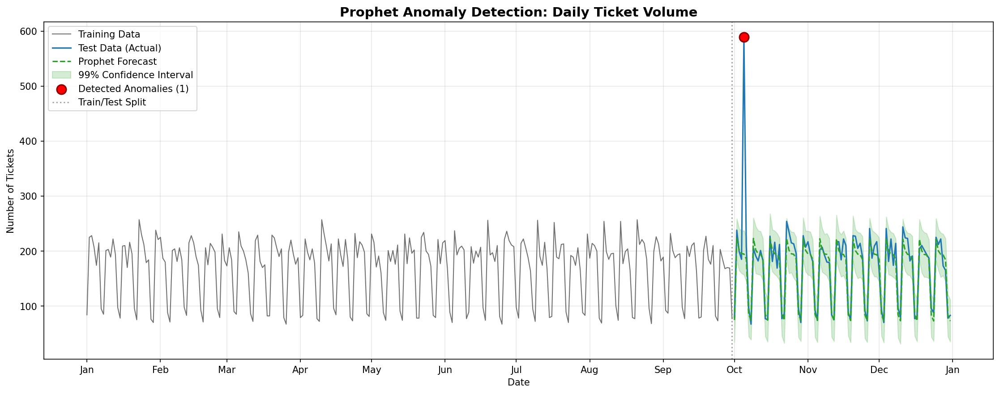
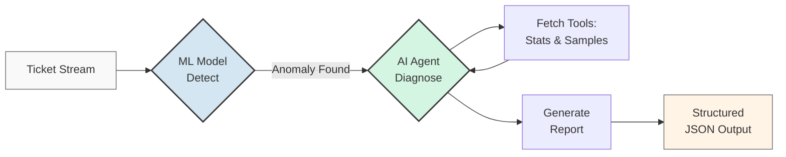
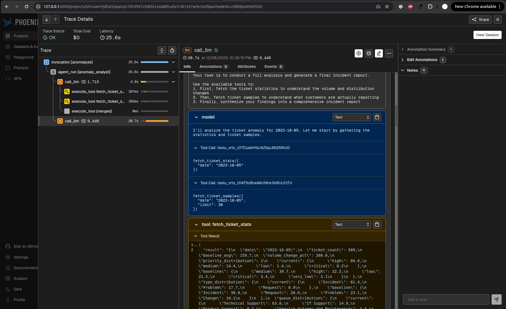
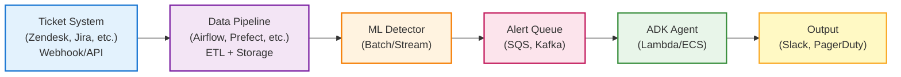

# Anomalyze: Hybrid CX Insight Engine

[](LICENSE)
[](https://www.python.org/downloads/)
[](#-engineering--validation)

> **"AI agents meet classical ML"**

Anomalyze is a production-grade prototype demonstrating a hybrid architecture for Customer Experience (CX) observability. It combines the statistical rigor of **Classical Machine Learning** for signal detection with the advanced reasoning of **Generative AI Agents** for root cause analysis.

This system is designed not just to flag anomalies, but to deliver actionable, structured insights that engineering and support teams can use immediately.


*(Example output from the ML detection module)*

## 🏗️ System Architecture

The architecture follows a "Detect-Diagnose-Report" pipeline, using the best tool for each stage.



1.  **Detect (Classical ML):** A time-series model (Prophet, LightGBM, or ARIMA) is trained on historical ticket volume. It continuously forecasts expected volume and flags any significant deviation from its prediction as an anomaly signal.
2.  **Diagnose (GenAI Agent):** When an anomaly is detected, a **Google ADK** agent is invoked with the anomaly's timestamp. The agent uses a set of tools to investigate, comparing ticket distributions against a baseline and reading raw customer complaints to understand the *semantic* nature of the incident.
3.  **Report (Structured Output):** The agent synthesizes its findings into a structured JSON report, identifying the root cause, quantifying the impact, and suggesting actionable recommendations.

## ⚡ Technical Highlights

This project demonstrates a production-oriented approach from data to deployment.

*   **Google ADK Agent:** A stateful agent built with the Google Agent Development Kit, featuring custom, data-aware tools and structured `pydantic` schemas for reliable output.
*   **Modular ML Backend:** A swappable model architecture with a consistent `fit`/`predict`/`detect_anomalies` interface supporting **LightGBM**, **Prophet**, and **ARIMA**.
*   **Production-Grade LightGBM:** Features time-series cross-validation for robust uncertainty estimation, avoiding the pitfalls of using in-sample residuals.
*   **Full Observability:** Integrated with **Arize Phoenix** via **OpenInference** for complete LLM call tracing. Visualize agent reasoning, tool executions, token usage, and latency in real-time through an intuitive web dashboard (see Phoenix screenshot in [Quick Start](#-quick-start)).
*   **Realistic Anomaly Simulation:** Uses real customer support text from HuggingFace, programmatically mapped to a synthetic time-series. This provides a reliable ground truth for validation without circular logic.
*   **Ops-Ready:** Comes with `Makefile` automation, Docker Compose for services, a `pyproject.toml` for dependency management, and a comprehensive `pytest` suite.

## 🧰 Tech Stack

This project leverages modern, production-grade tools across the AI and ML ecosystem:

| Component | Technology | Purpose |
|-----------|-----------|---------|
| **Agent Framework** | [Google ADK](https://github.com/google/adk-python) | Stateful agent orchestration with tool calling |
| **LLM Gateway** | [LiteLLM](https://github.com/BerriAI/litellm) + [OpenRouter](https://openrouter.ai/) | Unified interface to Claude, GPT-4, and other models |
| **Time-Series ML** | [Prophet](https://facebook.github.io/prophet/), [LightGBM](https://lightgbm.readthedocs.io/), [ARIMA](https://www.statsmodels.org/) | Forecasting and anomaly detection |
| **Observability** | [Arize Phoenix](https://docs.arize.com/phoenix) + [OpenInference](https://github.com/Arize-ai/openinference) | LLM tracing and debugging |
| **Data Source** | [HuggingFace Datasets](https://huggingface.co/datasets/Tobi-Bueck/customer-support-tickets) | Real customer support ticket text |
| **Validation** | [Pydantic](https://docs.pydantic.dev/) | Schema validation and type safety |
| **Testing** | [pytest](https://docs.pytest.org/) | Comprehensive data pipeline testing |

## 📁 Project Structure

```
.
├── agent/              # Google ADK Agent for root cause analysis
│   ├── tools/          # Custom tools for data fetching
│   └── schemas.py      # Pydantic schemas for structured output
├── ml/                 # Machine Learning pipeline for signal detection
│   ├── models/         # Pluggable model architecture (LGBM, Prophet, ARIMA)
│   └── features.py     # Time-series feature engineering
├── dataset/            # Data generation, exploration, and visualization
│   ├── preprocess.py   # Synthetic dataset generation with anomaly injection
│   └── visualize.py    # Time-series plotting utilities
├── tests/              # Pytest suite for data pipeline validation
├── docker-compose.yml  # Phoenix observability stack
├── Makefile            # Automation commands for setup and testing
└── pyproject.toml      # Dependency management and package metadata
```

## 🚀 Quick Start

### Prerequisites
*   Python 3.10+
*   Docker (for Phoenix observability)
*   An OpenRouter API Key (supports Anthropic, OpenAI, etc.)

### 1. Setup

```bash
# Clone the repository
git clone https://github.com/abdullahmeda/anomalyze.git
cd anomalyze

# Create virtual environment and install dependencies
make env
make install

# Configure your API key
cp .env.example .env
# Now, edit the .env file and add your OPENROUTER_API_KEY
```

### 2. Run the End-to-End Pipeline

```bash
# Step 1: Generate the dataset with an injected anomaly on Oct 5, 2023
make dataset
make prepare

# Step 2: Run the ML model to detect WHEN the anomaly occurred
# (Activate the virtual environment first)
source .venv/bin/activate
python3 -m ml.run --model lgbm --interval 0.99
# Expected Output:
#   LightGBM Anomaly Detection (99% CI)
#     Detected: 1 anomaly(s) | Ground truth: 2023-10-05
#     → 2023-10-05: 589 tickets (expected 198, bound 245)
#     Metrics: P=100% R=100% F1=100%

# Step 3: Run the ADK agent to diagnose WHY it occurred
python3 -m agent.run --date 2023-10-05
# Expected Output: A structured JSON incident report (see below)

# Step 4 (Optional): View agent traces in Phoenix
make start
# Open http://localhost:6006 in your browser
```

**Phoenix Dashboard Preview:**


*Live trace of the ADK agent showing tool calls, reasoning steps, and structured output generation*

## 🧠 The Intelligence Layer

### Part 1: Classical ML (The Signal)

We use specialized time-series models to learn the business's normal rhythm, including strong weekly seasonality. This provides a robust and cost-effective signal for the more expensive LLM agent.

*   **LightGBM (Recommended):** A gradient boosting model trained on a rich set of engineered features (`day_of_week`, `is_weekend`, `lag_1/7/14`, `rolling_mean_7d`). Uncertainty is estimated using residuals from 5-fold time-series cross-validation, providing a realistic measure of out-of-sample error.
*   **Prophet:** Facebook's additive model, excellent for handling seasonality and trend with minimal feature engineering. Serves as a powerful baseline.
*   **ARIMA:** A classical statistical benchmark (SARIMAX) configured to handle weekly seasonality.

All models are modular and can be extended by implementing the `AnomalyModel` interface.

### Part 2: GenAI Agent (The Root Cause)

Once a date is flagged, the **Google ADK** agent takes over. It is designed to mimic the workflow of a human Site Reliability Engineer.

#### Agent Tools

1.  `fetch_ticket_stats(date)`: Moves beyond simple volume. It retrieves distributional shifts across key categories (priority, ticket type, queue, tags) and compares them to a 7-day baseline average. This helps answer, "Is this spike *different* in character?"
2.  `fetch_ticket_samples(date, limit)`: Provides the qualitative evidence. It pulls raw text from customer tickets, allowing the agent to identify common error messages, complaint patterns, and customer sentiment.
    > **Production Enhancement:** This currently uses random sampling for simplicity and speed. A production system would benefit from embedding-based clustering (e.g., HDBSCAN with sentence transformers) to automatically surface the most representative and semantically distinct complaint themes, reducing redundancy and improving signal quality.

#### Structured Output

The agent is instructed via the system prompt to generate a JSON object that conforms to a `pydantic` schema. This ensures the output is machine-readable and reliable for downstream automation (e.g., creating a Jira ticket).

**Sample Output (`report.json`):**
```json
{
  "title": "Major Service Disruption Due to Server Overload",
  "executive_summary": "On October 5th, a critical issue led to a 268.8% increase in ticket volume, primarily affecting the Technical Support queue with high-priority incidents related to server performance and crashes.",
  "root_cause": "Server overload during peak times affecting multiple platforms, indicated by a surge in tags like 'Bug', 'Technical', 'Security', 'Outage', and 'Crash'.",
  "impact_metrics": {
    "volume_increase_pct": 268.8,
    "primary_priority": "high",
    "primary_queue": "Technical Support",
    "primary_type": "Incident"
  },
  "affected_services": ["Data Analytics Tool", "SaaS Platform", "Digital Campaign Integration"],
  "customer_sentiment": "Frustrated",
  "sample_complaints": [
    "Critical issue with data analytics tool crashing during report generation.",
    "SaaS platform crash due to server overload and resource constraints.",
    "Our digital campaign integration is failing due to repeated server timeouts."
  ],
  "recommendations": [
    "Immediately scale server capacity to handle the increased load and stabilize services.",
    "Investigate the root cause of the server overload, possibly related to a recent deployment or inefficient query.",
    "Implement more robust monitoring and alerting for server resource utilization to prevent future occurrences."
  ]
}
```
> **Note on ADK Structured Output:** Google ADK does not currently support native Pydantic-based structured output when combined with tool calling in a single agent ([see discussion](https://github.com/google/adk-python/discussions/322)). This prototype uses a proven workaround: the desired JSON schema is embedded in the system prompt with explicit instructions for the LLM to format its final response accordingly. For production use cases requiring stricter guarantees, consider implementing a two-agent pattern where a parent agent with tools delegates to a child agent with structured output, or use `response_mime_type="application/json"` for schema-free JSON responses.

## 🌐 Production Deployment & Real-World Usage

This prototype is designed with production considerations in mind. Here's how it could be deployed in a real-world environment:

### Deployment Architecture



### Integration Patterns

1. **Real-Time Monitoring:** Deploy the ML model as a streaming service (e.g., AWS Kinesis, Kafka Streams) that processes ticket volumes in near-real-time. When an anomaly is detected, trigger the agent via an event queue.

2. **Scheduled Batch Analysis:** Run the detector on a cron schedule (e.g., every 15 minutes) using Airflow or similar. This is more cost-effective for systems with moderate ticket volumes.

3. **Incident Management Integration:** Automatically create Jira tickets or PagerDuty incidents from the agent's structured JSON output. The schema is designed to map directly to incident fields.

4. **Slack/Teams Alerts:** Use the agent's `executive_summary` and `recommendations` to generate human-readable messages. The structured format ensures consistent, actionable alerts.

### Scaling Considerations

*   **ML Model:** The LightGBM model is lightweight (~50ms inference on CPU). Prophet and ARIMA are slower but still suitable for batch processing. For high-frequency updates, consider caching predictions or using a model server (e.g., TorchServe, BentoML).
*   **Agent Invocation:** The ADK agent makes 2-4 LLM calls per analysis (~30-60 seconds total). To reduce latency, consider using faster models (e.g., GPT-4o-mini, Claude Haiku) for non-critical periods or implementing request batching.
*   **Cost Management:** Agent analysis costs ~$0.10-0.30 per incident with Claude Sonnet 4.5. Use confidence thresholds on the ML detector to minimize false positives and unnecessary agent invocations.

### Environment Variables

For production deployment, configure these environment variables:

```bash
OPENROUTER_API_KEY=your-key-here       # LLM API access
PHOENIX_COLLECTOR_ENDPOINT=...         # Optional: External Phoenix instance
DATA_PATH=/path/to/ticket/data         # Path to your ticket database
ANOMALY_THRESHOLD=0.99                 # Confidence interval for detection
ALERT_WEBHOOK=https://...              # Slack/Teams webhook URL
```

### Monitoring & Observability

*   **ML Performance:** Track precision, recall, and false positive rate over time. The included evaluation metrics provide a starting point.
*   **Agent Quality:** Use Phoenix to monitor LLM token usage, latency, and error rates. Review agent reasoning traces to identify failure modes.
*   **Business Metrics:** Measure time-to-detection (how quickly anomalies are flagged) and time-to-resolution (how actionable the agent's recommendations are).

## 🛠 Engineering & Validation

This project was built with engineering rigor to ensure it is robust, reproducible, and extensible.

*   **Testing:** A comprehensive 22-test suite using `pytest` validates the entire data pipeline. Tests cover:
    *   Data quality and schema validation
    *   Train/test split integrity (ensuring anomalies only appear in test set)
    *   Anomaly volume characteristics (~3x baseline with 20% tolerance)
    *   Metadata consistency across all generated files
    *   Temporal ordering and uniqueness constraints
    
    Run with `make test` from the project root. All tests must pass before the ML models can be trained.

*   **Reproducibility:** The dataset generation process is deterministic, controlled by `RANDOM_SEED=42` in `dataset/preprocess.py`. This ensures identical anomaly characteristics across runs, enabling reliable benchmarking and debugging.

*   **Modularity:** The ML models implement a consistent `AnomalyModel` interface with `fit()`, `predict()`, and `detect_anomalies()` methods. The agent's tools are stateless functions that can be extended or replaced without modifying the agent logic.